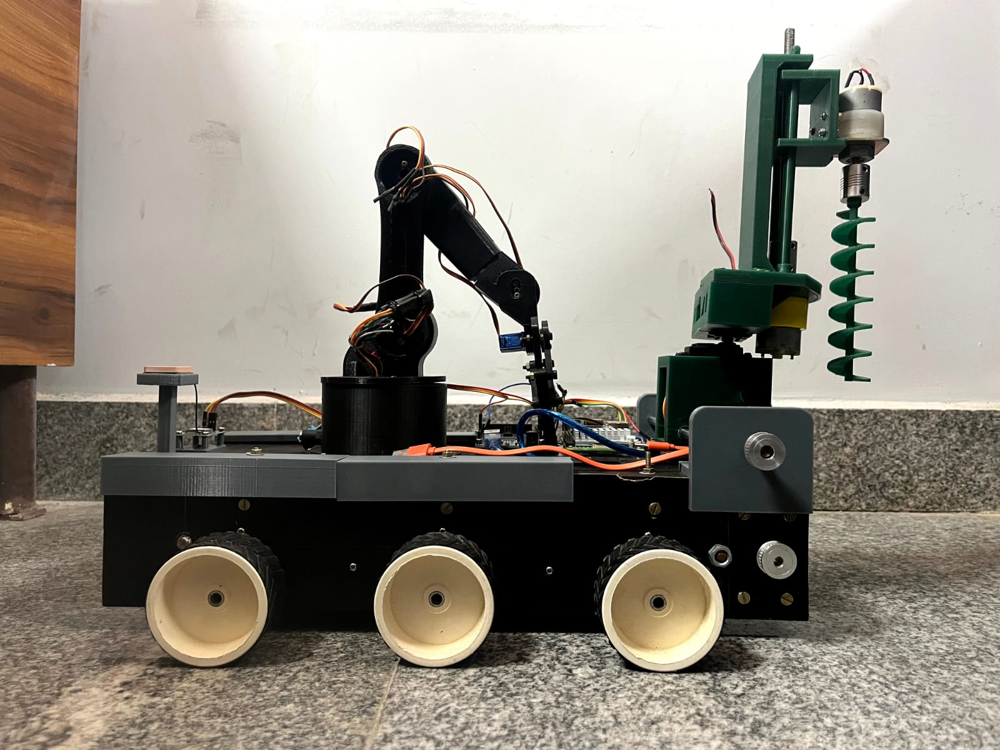

# 🤖 Robotic Arm Model

This repository contains the code and documentation for a 4-DOF (Degrees of Freedom) Robotic Arm controlled using an Arduino Mega 2560 and dual-axis joystick modules. The project is designed as a low-cost, educational prototype to demonstrate pick-and-place functionality using servo motors.

---

## 📷 Project Photo



---

## 🚗 Rover Integration

The robotic arm is **mounted on an RC rover platform**. The arm and the rover are **controlled independently**:

- The **rover** handles locomotion and is driven by its own controller / receiver.
- The **robotic arm** is operated separately (as described below) using its own Arduino Mega 2560 and joystick modules.

Mounting the arm on the rover makes the system mobile, allowing pick-and-place and object manipulation while moving around the workspace.

---

## 📌 Features

- 4-DOF robotic arm movement (gripper, wrist, elbow, and base)
- EEPROM-based memory to store last servo positions
- Joystick-controlled real-time servo movement
- Simple and reproducible hardware design using SG90 servos

---

## 🧠 Technologies Used

- **Hardware**: Arduino Mega 2560, SG90 Servo Motors, Dual Axis Joysticks
- **Software**: Arduino Programming (C/C++), EEPROM Library, Servo Library
- **Tools**: Arduino IDE / VS Code with PlatformIO, Git/GitHub

---

## 🛠️ How to Use

### 1. Requirements
- Arduino Mega 2560
- 4x SG90 Servo Motors
- 2x Dual Axis Joystick Modules
- Jumper wires
- Power Supply (12V adapter)

### 2. Setup Instructions
1. Clone this repo:
   ```bash
   git clone https://github.com/Anshuman-02/Robotic-Arm-Model.git
   cd Robotic-Arm-Model
   ```
2. Open `robotic_arm.ino` in Arduino IDE or VS Code (with PlatformIO).
3. Connect components as per circuit diagram.
4. Upload the code to the Arduino board.
5. Use the joysticks to control the robotic arm in real time.

---

## 🔌 Circuit Connections

### Joystick to Arduino
| Joystick Pin | Arduino Pin |
|--------------|-------------|
| 5V           | 5V          |
| GND          | GND         |
| VRX (J1)     | A0          |
| VRY (J1)     | A1          |
| VRX (J2)     | A2          |
| VRY (J2)     | A3          |

### Servo to Arduino
| Servo        | Arduino Pin |
|--------------|-------------|
| Gripper      | D6          |
| Up/Down      | D9          |
| Front/Back   | D11         |
| Neck         | D10         |

---

## 📅 Project Timeline

- **Phase 1**: Literature review, design planning (Aug–Dec 2024)
- **Phase 2**: Implementation and testing (Jan–Apr 2025)

---

## 📜 License

This project is open source and available under the [MIT License](LICENSE).

---
